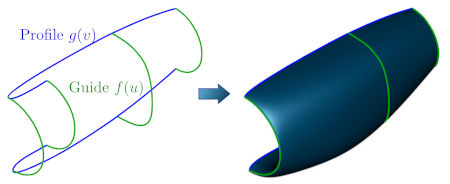

# occ_gordon: A Curve Network Interpolation Library for OpenCASCADE (OCCT)

__occ_gordon__ is a lightweight C++ and python library that implements __curve network interpolation__ using B-spline surfaces within the __OpenCASCADE (OCCT)__ framework.

OCCT  lacks built-in support for __Gordon surface interpolation__, which is a method for interpolating arbitrary large curve networks. This library was developed to provide this functionality, enabling engineers and developers to create smooth, accurate surfaces from interconnected curves in OCCT.

## What is a Curve Network?

A curve network is a collection of interconnected curves that define the structural framework or "skeleton" of a surface or shape. By interpolating a curve network, complex surfaces can be accurately created.



## Key Features ⭐

 - ✨ __Gordon Surface Interpolation__: Implements the Gordon surface interpolation method, a generalization of the Coons patch, ideal for generating smooth B-spline surfaces from an arbitrary number of profile and guide curves.
 - 🔧 __Curve Network Reparametrization__: Compared to other implementations, occ_gordon reparametrizes the curve network if necessary to ensure proper interpolation of the curves.
 - 🤝 __OpenCASCADE Integration__: Fully integrated with OpenCASCADE, ensuring compatibility with OCCT-based projects.
 - 🐍 __Python Support__: With Python bindings, occ_gordon can be seamlessly integrated with __pythonocc__, the Python interface for OCCT.
 - 🚀 __Lightweight__: Based on a streamlined, minimal version of the [TiGL library](https://github.com/DLR-SC/tigl), focusing solely on curve network interpolation using B-splines. No other dependencies than OCCT.
 - 🔓 __Open Source and Apache Licensed__: Available under the permissive Apache 2.0 license, making it suitable for both personal and commercial use.

## About the Gordon Surface Method

The __Gordon surface interpolation__ method was first published by W.J. Gordon in 1969. It allows for surface generation through the interpolation of an arbitrary number of guide and profile curves using B-splines. It extends the  __Coons patch__ method to more complex curve networks, making it versatile tool for __surface modeling__ in __3D CAD applications__.

## Usage Example

To use the __occ_gordon__ library, include the header file `<occ_gordon/occ_gordon.h>`. The main function for curve network interpolation is `occ_gordon::interpolate_curve_network`.

```cpp
#include <occ_gordon/occ_gordon.h>

std::vector<Handle(Geom_Curve)> vcurves, ucurves;

// Create the curve network
...

double inters_tol = 1e-4; // distance, in which the curves need to intersect

auto surface = occ_gordon::interpolate_curve_network(ucurves, vcurves, inters_tol);
```

This example demonstrates how to interpolate a curve network using a B-spline surface with a specified intersection tolerance.

## Building

To build occ_gordon, you'll need a recent version of __CMake__ (3.15 or higher) and a working installation of __OpenCASCADE__.

```
cmake -S . -B build -DOpenCASCADE_DIR=<path/to/cmake/opencascade> -DCMAKE_INSTALL_PREFIX=<path/to/install>
cmake --build build
cmake --build build --target install
```

## License

occ_gordon is licensed under the __Apache 2.0 License__, making it free to use, modify, and distribute in both personal and commercial projects.

## Citing

This algorithm was originally developed as part of the __TiGL library__.
If you use the occ_gordon library in your work, please cite the following paper:

[Siggel M. et. al. (2019), _TiGL: An Open Source Computational Geometry Library for Parametric Aircraft Design_](https://doi.org/10.1007/s11786-019-00401-y)

```
@article{siggel2019tigl,
	title={TiGL: an open source computational geometry library for parametric aircraft design},
	author={Siggel, Martin and Kleinert, Jan and Stollenwerk, Tobias and Maierl, Reinhold},
	journal={Mathematics in Computer Science},
	volume={13},
	number={3},
	pages={367--389},
	year={2019},
	publisher={Springer},
    doi={10.1007/s11786-019-00401-y}
}
```
